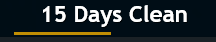
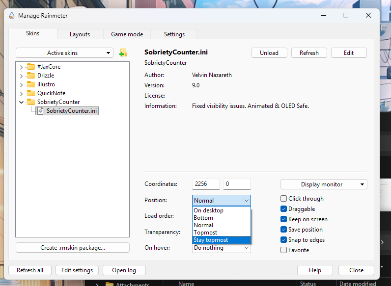

# Sobriety-Counter-Skin-for-Rainmeter-
A minimalist, OLED-safe sobriety counter skin designed for the Windows Taskbar. Features smooth 60FPS animations, pixel-shifting burn-in protection.

# Minimalist Sobriety Counter (Rainmeter)

A clean, OLED-safe, minimalist sobriety counter designed to sit seamlessly on the Windows 11 Taskbar.
Built with the "Illustro" style guide and optimized for low resource usage (1Hz update rate with idle sleep).



## Features
* **Zero-Footprint:** Fits on standard 30px-48px taskbars.
* **OLED Protection:** Implements "Pixel Shifting" logic to prevent burn-in.
* **Native Look:** Uses Segoe UI to match Windows system text.
* **Animations:** Subtle "heartbeat" pulse and smooth transitions.

* ## Functionality
* **Multi-Addiction Fighter:** Used for any type of addiction a person if suffering from be it Smoking, Alcohol, Adult content consumption, Social media.
* **Set a Goal** Set a goal date until when you want to quit. Gives a indepth detail and a progress bar visualizing your progress until the goal date is achieved.

## Installation
1. Install [Rainmeter](https://www.rainmeter.net/).
2. Clone this repo into your skins folder:
   ```bash
   cd ~/Documents/Rainmeter/Skins/ #Default location for Rainmeter skins
   git clone https://github.com/velcan/Sobriety-Counter-Skin-for-Rainmeter-.git
3.Open Rainmeter, find SobrietyCounter, and load Sobrietycounter.ini

**For Best Results and effective visibility of the skin on your rainmeter select the postion as topmost**



## Configuration
1. Open Counter.ini and edit the Variables section:

 ```bash
; Format: YYYY-MM-DD
StartDate=2025-12-15  #Set the date on which you want to start your addiction recovery process.

GoalDate=2026-01-18   #Set the goal date preferably a week or a month from your start date. Smaller goals like a week or a month is proven to be better.
```

All the best on your recovery journey
